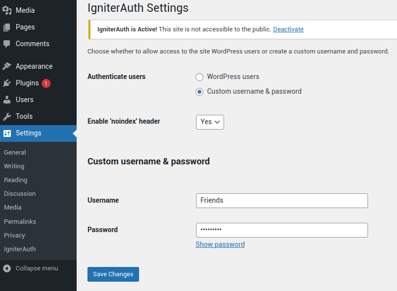

# IgniterAuth - WordPress site lock

## Overview
IgniterAuth protects your website from the being accessible to the public and bots. It's particularly useful when deploying beta or staging environments to make the site inaccessible to the public and also protect it from being crawled and indexed by search bots.

## Installation

- Download the zip file from the repository
- Login to your WordPress admin dashboard
- Go to "Plugins" -> "Add New"
- Upload the zip file and WordPress will install the plugin
- Activate the plugin to password protect your site

## Installation via Composer

Run the following command to install the plugin via Composer

```sh
composer require affilipoint.com/igniterauth
```

## How to use the plugin

Once activated your site will be automatically protected with the HTTP Authentication prompting you to enter a username and password.

**`Note: If you are already logged in as the admin, you won't be requested to enter a username and password.`**

### Default login credentials

By default you can authenticate by using any WordPress user credentials for your site. If the credentials are valid you will be logged in.

### Create a custom username and password

If you wish to give access to users who do not have an account on your site, you can create a custom username and password.

To do so:
- Go to the plugin settings **`Settings > IgniterAuth`**
- Check '**Custom username & password**'
- Enter a username / password of your choice and click on '**Save Changes**' button



### Enable 'noindex' header

YOu can also add a `noindex` meta tag and `X-Robots-Tag: noindex` in the header of your site by enabling it in the settings.

This will discourage search bots to index your site.

## Removing HTTP authentication site lock

To remove the site lock authentication, simply deactivate the plugin and your site will be accessible to the public.

All your settings will be saved is you choose to re-activate the plugin again.
